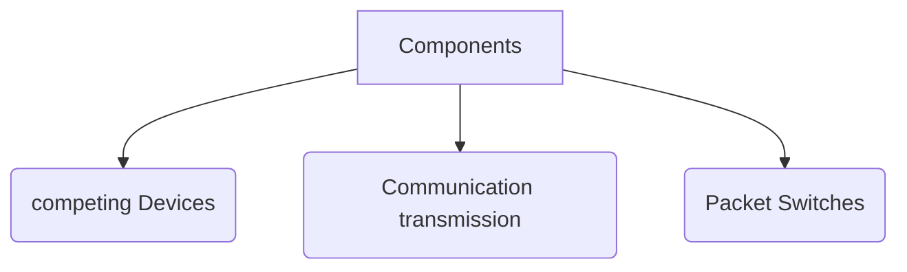
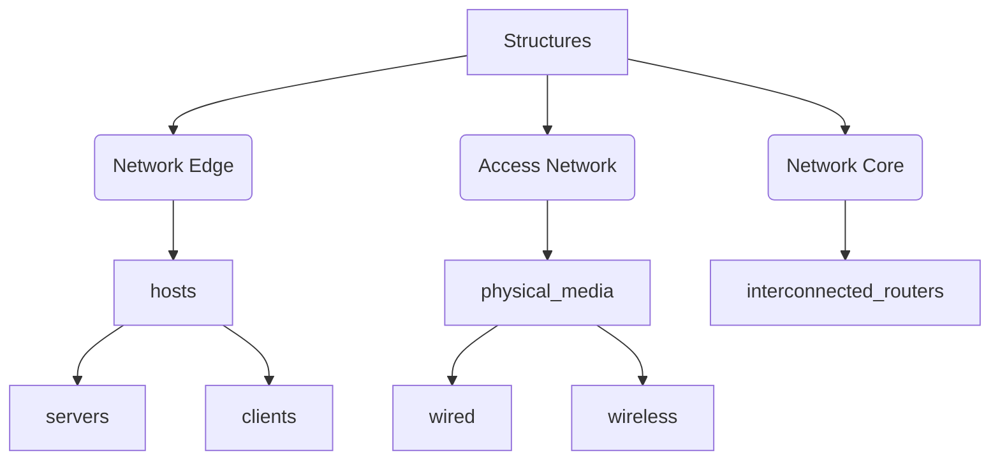
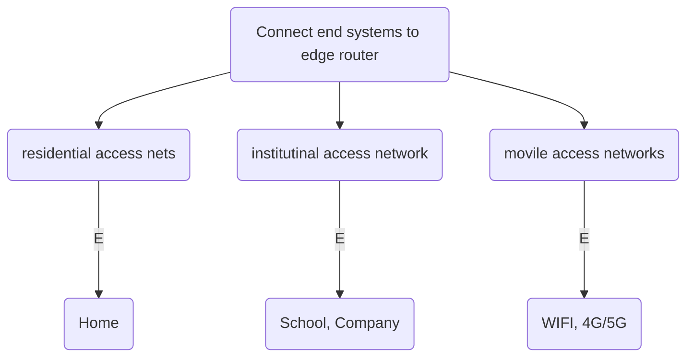

# Chapter 1:  Introduction

---

### Guidelines

- **Internet**
    - Structure
        - Network edge: hosts, access network, physical media
        - Network core: packet/circuit switching, internet structure
    - Performance
        - loss
        - delay
        - throughput
    - Security
    - History
- **protocol**
    - Protocol layers, service models

---

# Internet

- **Billions of connected computing devices**
- **Network of Networks**
- C**ollection of ISPs**

## Internet Structure (**Network of Network)**

## Network

**Collection of devices routers, links: managed by an organization** 

### Network Component

### **Network Layers**

## Internet Structure

## Network Edge

- Servers
- Clients

## Access Network

**connect end systems to edge router** 

## First: Move data from ISP to Edge router

## 1. Cable-Based Access

### **Connect to the Internet via Television cable.**

**📝 splitter take the signal from Cable and the** 
         **⇒ Signals Data       ⇒ Cable goes to *internet* 
         ⇒ Signals Videos ⇒  Cable goes to *television***  

### Cable Properties

**Start⇒** CMTS (Cable Modem Termination System)

**End⇒** Cable Modem

************Cable************ 

**Type**  
               HFC (Hybrid fiber coax)

**Speed
              downstream ⇒** 40MB-1.2GB 
            **Upstream         ⇒**  30-100 MB 

📝  **Speed is asymmetric**  if you have 100 devices connected to cables each devices take 1.2GB / 100 = 12 that mean Max 12MB for each devices (This is disadvantage) 

**Methodology**  

        ****Channels & Frequency(send the data to the channel that have same freq.) [Here](https://velog.velcdn.com/images%2Fshonsk0220%2Fpost%2F2aaae04f-b8a7-4cc3-8118-e04d55b63ad2%2Fimage.png)

> **This Methodology Name is FDM(frequency division multiplexing):** 
Different Channels transmitted in different frequency bands
> 

**Access Among user ⇒  Shared** 

## 2. Digital Subscriber Line (DSL)

### **Get internet access via telephone line.**

**📝 splitter take the signal from DSL and the** 
         **⇒ Data   ⇒ over DSL phone line goes to *internet* 
         ⇒ Voice ⇒  over DSL phone line goes to *telephone***  

### DSL Properties

- **Start⇒** DSLAM(DSL Access Multiplexer )
- **End⇒**  DSL Modem
- **Speed
              downstream ⇒** 24MB-52MBps 
            **Upstream         ⇒**  3.5-16MB
- **Access Among user ⇒  Dedicated**

## Communication transmission

[https://lh5.googleusercontent.com/vggRaddYbDI8Dm8fxVH7imMDdX9feEIniwuTi-jJqrnf9huSsVo7IeGb6ZGUOTqVuppAZ7krz-Q5ncg95KI_ATiAJdzD82Py6t8sVsZB-lMhnined9NcO09CRcPIXW8wKf_hF9Qwv3vFCesePwo-J5X3eIhoTRSP2fqGz5WVbaJSBA2QuepSr8OsXA](https://lh5.googleusercontent.com/vggRaddYbDI8Dm8fxVH7imMDdX9feEIniwuTi-jJqrnf9huSsVo7IeGb6ZGUOTqVuppAZ7krz-Q5ncg95KI_ATiAJdzD82Py6t8sVsZB-lMhnined9NcO09CRcPIXW8wKf_hF9Qwv3vFCesePwo-J5X3eIhoTRSP2fqGz5WVbaJSBA2QuepSr8OsXA)

T**hey different in transmission rate `Bandwidth`** 

### Guided Media (Wired)

|  | Twisted pair TP | Coaxial cable | Fiber optic |
| --- | --- | --- | --- |
| Description  | Two Insulated copper wires | * Two Concentric 
    copper conductors
* bidirectional  | * glass fiber
* carrying light pluses
* pluses = bit |
| Types | Unshielded Twisted Pair (UTP)
Shielded Twisted Pair (STP)     | RG59 
RG6 | Single mode fiber (SMF) 
Multimode fiber (MMF)   |
| Speed | Cat5 
⇒ 100mb - 1Gbpsec
———————————
Cat 6
⇒10Gbpsec
”Ethernet” | 100’s Mbps per channel | 10’s - 100’s Gbps  |
| Bandwidth | low bandwidth. | moderately bandwidth. | very high bandwidth. |
| Data rate | low data rate. | Moderately data rate. | Very high data rate. |
| Attenuation |  very high attenuation. |  low attenuation. | very low attenuation. |
| Noise immunity | low noise immunity. | higher noise immunity. | highest noise immunity. |
| Cost | The cost is very low. | Cost is moderate | Cost is expensive. |
| Pros | * use exitance 
    telephone cable

* low deployment cost | * use exitance 
    coaxial cable

* low deployment cost | Low error rate 
  ⇒ immune to 
       electromagnetic 
       noise 
  ⇒ repeaters spaced 
        far part  |

### Unguided Media (Wireless)

|  | Wireless radio |
| --- | --- |
| Description  | Two Insulated copper wires |
| Types | * Terrestrial microwave
* Wireless LAN (WIFI)
* Wide-area
* Satellite
  |
| Speed | Terrestrial microwave 
⇒ 45Mbps per channel 
———————————
Wireless LAN (WIFI)
⇒100’s Mbps
———————————
Wide-area (cellular)
4G⇒10’s Mbps
———————————
Satellite
⇒45’s Mbps per channel
⇒ 270 msec end-end delay |
| Pros | ideal for frequency travelers  |
| Cons | geosynchronous versus low-earth orbit  |

## Shared Vs Dedicated

|  | Shared  | Dedicated  |
| --- | --- | --- |
| Server  | other site can host with your site  | your website only hosted |
| Bandwidths  | limited  | not limited (dedicated to yo only) |
| Cost | cheaper (total cost divided up among the users) | Expensive (You pay for total cost) |
| Tech Skills | not require (cause hosting provider is mange all tech skills) | required (cause you are  hosting provider that will mange all tech skills) |
| Performance  | Slow response  & loading time  | High response & Loading time  |

## Second: distribute Data from Edge router to End Systems

|  | Wireless Local  Area Networks (WLANs) | Wide Area Cellular Access Networks  | Enterprise networks  |
| --- | --- | --- | --- |
| Cover  |  Building (100Ft) | District  (10’s km) | Company, university or group of building  |
| Speed  | 11, 45, 450 Mb | 10 mb | 
WIFI:
⇒  11, 45, 450 Mb
—————————
Ethernet
Wired access at 100Mbps, 1Gbps, 10Gpbs 
 |
| Consist of  | 
1- Cable or DSL Modem               ⇒  Connect from ISP to router
———————————————
2- router, firewall, NAT                ⇒  Connect from router to WIFI
———————————————
3- WIFI wireless access point 
⇒  spread the internet all over the area
https://velog.velcdn.com/images%2Fshonsk0220%2Fpost%2F89cb458d-e547-444d-b7a2-400c7614f5fa%2Fimage.png | 
Mobile, Cellular Network  
⇒ Connect from ISP to End User Directly (Wireless) | 
Mix of Wired, Wireless link technologies 
⇒  Connect from ISP to router
——————————
Mix of Switches and routers 
⇒ Connect from router to Spread the Internet |
| Ex  | WIFI  | 4G /5G |  |

## Network Core

**Mesh of Interconnected routers** 

## Switching

### Router Vs Switch Vs Hub (Addition from me)

| Hub | Switch | Router |
| --- | --- | --- |
| HUB work on Physical Layer of OSI Model | Switch work on Data Link Layer of OSI Model | Router work on Network Layer of OSI Model |
| HUB is Broadcast Device | Switch is Multicast Device | Router is a routing device use to create route for transmitting data packets |
| Hus is use to connect device in the same network | Switch is use to connect devices in the same network | Router is use to connect two or more different network. |
| Hub sends data in the form of binary bits | Switch sends data in the form of frames | Router sends data in the form packets |
| Hub only works in half duplex | Switch works in full duplex | Router works in full duplex |
| Only one device can send data at a time | Multiple devices can send data at the same time | Multiple devices can send data at the same time |
| Hub does not store any mac address or IP address | Switch store MAC Address | Router stores IP address |

[Hub, Switch, & Router Explained - What's the difference?](https://www.youtube.com/watch?v=1z0ULvg_pW8)

### Packet Switching

***take packets from host & transmit individually to the network***

### **How it work**

1. ***hosts* break application-layer messages into packets**
2. **forward packets from one router to the next *from source to destination (transmission)***
3. **each packet transmitted at full link capacity**

---

### Transmission **operation (Push out)**

**Type   ⇒ Store & Forward
 |Store and forward:** entire packet must arrive at router before it can be transmitted on next link

**Delay ⇒ L/R Second
 | L →** number of bit in 1 packet (bits) **** R** → link transmit rate (bps)

---

### queueing delay & Loss

**packets will queue, waiting to be transmitted on output link**

⇒ **if *arrival rate (in bps) to link > transmission rate (bps) of link* for a period of time**

---

**Example** 
arrival rate to link = 100 Mb/s
transmit rate of link=1.5Mb/s **where** arrival  > transmit 
⇒ packets will queue,

---

<aside>
🚨 **if memory (buffer) in router fills up ⇒ packet can be dropped (Lost)**

</aside>

### Important Def of key network-core functions

**Forwarding** 
⇒ *local action:* move arriving packets from router’s input link to appropriate router output link

**Routing**
⇒ *global action*: determine source-destination paths taken by packets
⇒ routing algorithms

### Circuit switching

**Allocate end-end resources between source & destination** 

Before start connect we Allocate the the distention + each path we will take 

### **How it work**

1. **dedicate resources that sharing
| resource that dedicated by another call called *no sharing*** 
2. **pick path between source and desiccation** 
3. **send  the message** 

### Type of Circuit Switching

|  | Frequency Division Multiplexing (FDM) | Time Division Multiplexing (TDM) |
| --- | --- | --- |
| Division  | optical electromagnetic frequencies 
divided into 
(narrow) frequency bands | time 
divided into 
slots |
| Allocated | Own band | periodic slot(s) |
| Transmit  | max rate of that narrow band | max rate of (wider) frequency band |
| pros  | sending message all the time  | Send message in max rate without control |
| cons  | but only max of frequency band  | only during its time slot(s) |

### Circuit Vs Packet

|  | Circuit  | Packet  |
| --- | --- | --- |
| Call setup  | Require  | not required  |
| Store-and-forwarded transmission  | No | Yes |
| resource sharing | No | Yes |
| Loss in data | No | Yes |
| Dedicated physical path | Yes | No |
| Each packet follow the same rout | Yes | No |
| Packets arrive in order  | Yes | No |
| Is a switch crash fatal  | Yes | No |
| Bandwidth available  | Fixed | Dynamic  |
| Time of possible congestion | At setup time | On every packet  |
| Charging  | per minute | per packet  |
| Potentially wasted bandwidth  | Yes | No |
| Transparencies  | Yes | No |
| Pros  | High Performance  | Allow more user |
| Cons | have exact number of user | Low performance  |
| Example | telephone networks |  |

## Internet Performance

## Security

---

# Protocols

## Introduction

### Def

- **Collection of rules**
- **Define the format order of messages sent and received among network entities and actions taken on msg transmission receipt**
- **Control Sanding and receiving messages**

### Protocols Example According to Network Layer

### Internet Standard invented by :

- **RFC**: Request for Comments
- **IETF** : Internet Engineering Task Forces

### How Protocols works

---

# Questions

# Resources

[What is OSI Model | 7 Layers Explained | Imperva](https://www.imperva.com/learn/application-security/osi-model/)

[1. شبكات الحاسوب | Chapter 1, Part 1](https://www.youtube.com/watch?v=JeNSdjKBPA8&list=PLpHpCzb7rhlV1MbRgGwTIoK1kHW3iWdmh)

[Difference between Coaxial Cable and Twisted Pair Cable - GeeksforGeeks](https://www.geeksforgeeks.org/difference-between-coaxial-cable-and-twisted-pair-cable/)